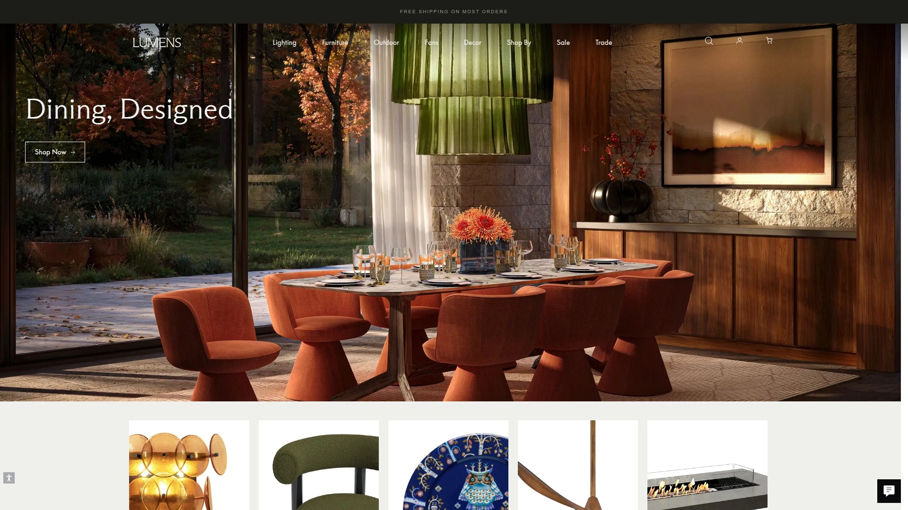
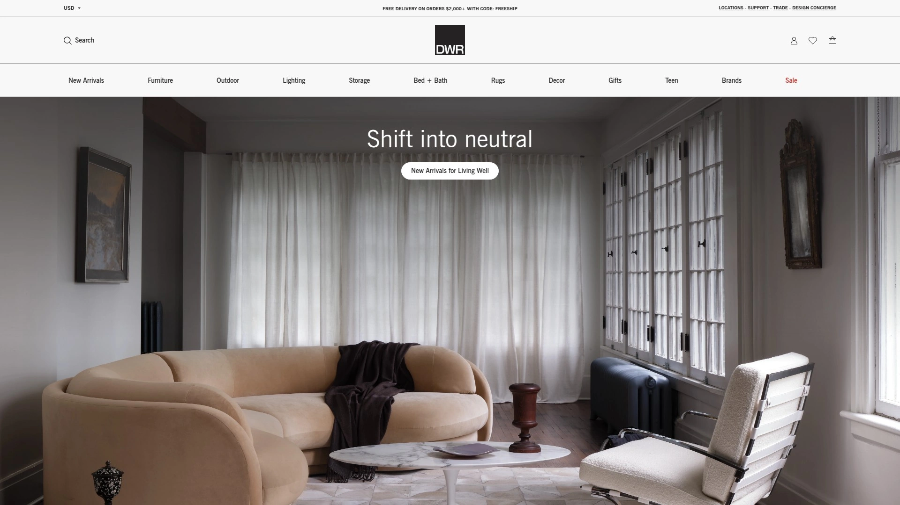
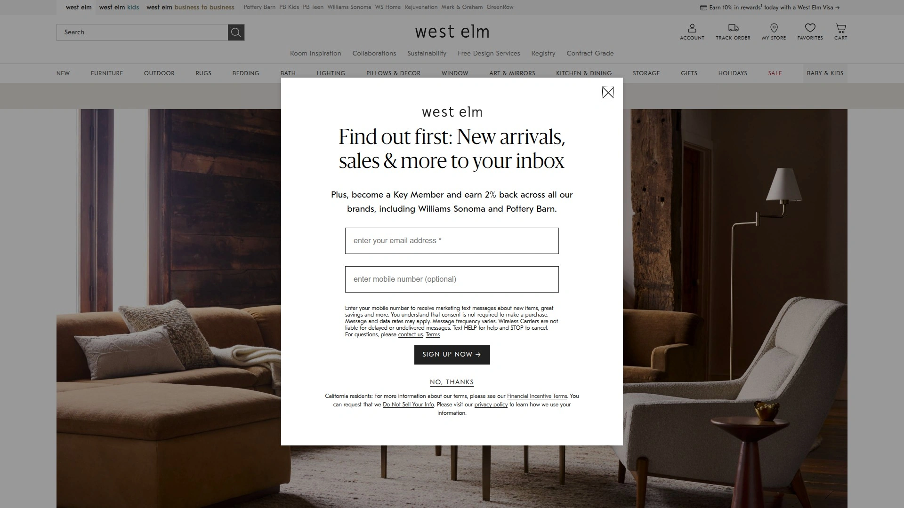
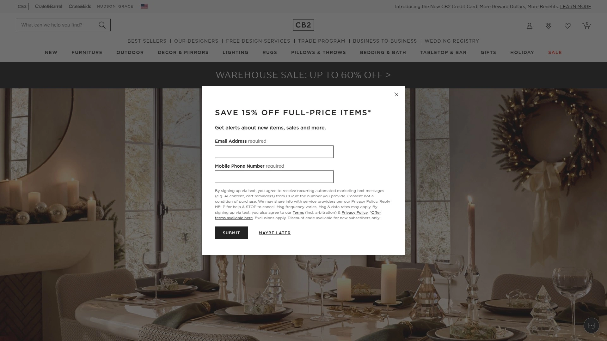
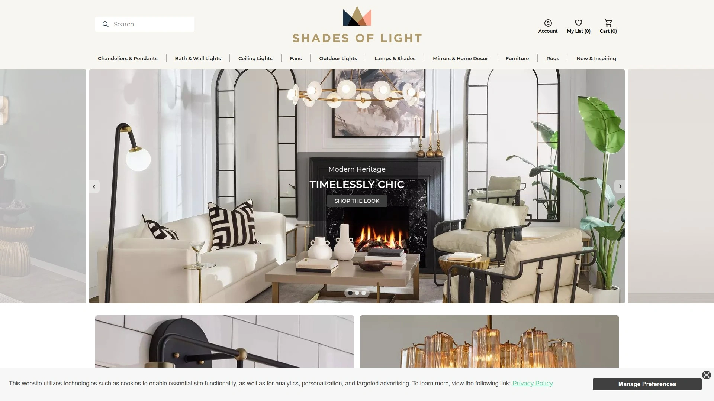
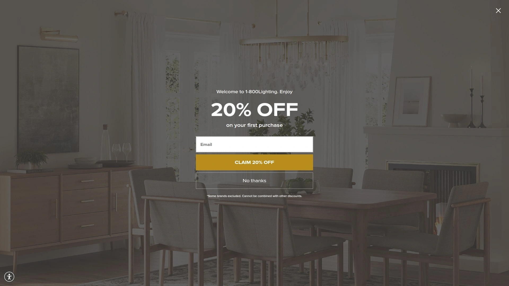
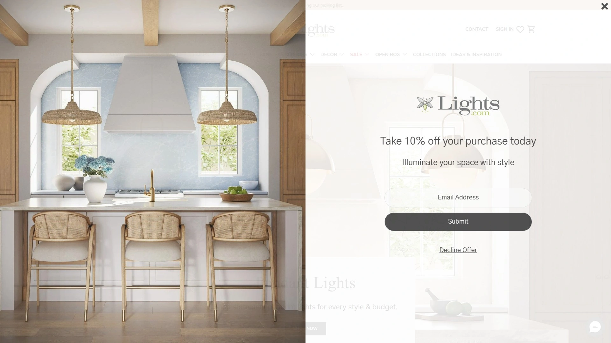

# 2025's Top 10 Best Modern Lighting Retailers

Finding the perfect light fixture used to mean visiting showrooms across town, dealing with pushy sales staff, and hoping that chandelier you liked actually fits your dining room ceiling height. Online lighting retailers flipped that exhausting process by letting you browse thousands of designer fixtures from your couch, visualize pieces in your space through augmented reality apps, and read real customer reviews about whether that trendy pendant light actually delivers quality illumination or just looks good in product photos. The challenge now isn't finding places to buy lighting—it's figuring out which retailers balance curated design selection, reliable shipping that won't shatter that glass globe pendant in transit, and return policies flexible enough to handle the "this looked different in person" reality.

What separates lighting retailers that transform spaces from ones leaving you with buyer's remorse comes down to whether their product photography accurately represents finishes and scale, if customer service understands the difference between lumens and color temperature when you call confused, and whether they stock both accessible mid-range fixtures and investment pieces from recognized designers. These retailers handle everything from basic flush mounts through statement chandeliers that become room centerpieces without requiring interior designer budgets or contracts.

## **[Lumens](https://www.lumens.com)**

The lighting authority where modern design meets comprehensive selection.

Lumens established itself as the definitive online destination for contemporary lighting by combining the extensive catalog of a lighting superstore with the curated taste of a high-end design showroom. The platform carries over 70,000 products from 750+ brands spanning budget-friendly options through museum-quality designer pieces, eliminating the need to hop between multiple retailers when outfitting different rooms at different price points. What makes this work for actual renovations rather than fantasy wish lists is how Lumens organizes overwhelming choice through intelligent filtering—search by room, style, finish, size, and price simultaneously to narrow 10,000 pendant options to the 30 that actually fit your needs.

The **Exclusively at Lumens** collection provides access to limited-edition pieces and exclusive colorways from established brands like Flos, Rich Brilliant Willing, and Sonneman that you won't find anywhere else. These collaborations deliver designer cachet without the wait times typical of fully custom lighting. The reformulated YLighting brand merged into Lumens in recent years, consolidating two major modern lighting retailers into one comprehensive source while maintaining the best aspects of both.

**Trade program** serves interior designers and architects with dedicated account managers, wholesale pricing, and project-specific support that handles complex multi-fixture installations. Design professionals access expedited shipping, customization options, and technical specifications crucial for commercial installations. Retail customers benefit from the infrastructure built for trade, receiving the same high-touch service during purchase decisions.

Product pages include detailed specifications—exact dimensions, weight, mounting requirements, bulb compatibility, energy consumption—eliminating the guessing that causes post-delivery disappointment. Multiple high-resolution images show fixtures from various angles while lifestyle shots demonstrate scale in actual rooms. Customer reviews filter by verified purchases, with photos showing how fixtures look installed rather than just studio shots.

**Virtual design consultation** connects buyers with lighting specialists who provide personalized recommendations based on room photos, dimensions, and style preferences. These consultations happen via video call rather than requiring in-store visits, making expert guidance accessible regardless of location. The service handles questions about lumens output, installation complexity, and compatibility with existing wiring without charge.

Free shipping on orders over reasonable thresholds keeps costs predictable, while price-match guarantees ensure you're not overpaying compared to competitors. The 30-day return policy with free return shipping reduces risk when buying expensive fixtures sight-unseen. Extended warranties on select products provide additional protection for investment pieces.

**Warehouse sales** offer significant discounts on overstock, discontinued, and open-box items, making designer lighting accessible at mid-range budgets. These sales include everything from minor cosmetic imperfections through brand-new fixtures being cleared for incoming inventory. The selection changes frequently but checking regularly yields substantial savings.

Learning center content includes installation guides, design tips, and trend reports that educate buyers beyond just product selection. Articles explain technical concepts like color rendering index and beam angles in accessible language, empowering informed decisions rather than relying entirely on salesperson guidance.

**Best applications:** Design enthusiasts wanting comprehensive modern lighting selection, professionals needing trade pricing and project support, homeowners tackling whole-home renovations requiring fixtures across multiple styles and budgets, anyone valuing expert consultation during decision-making.

## **[Lamps Plus](https://www.lampsplus.com)**

America's largest lighting retailer balancing selection breadth with approachable pricing.

Lamps Plus operates 40+ physical showrooms alongside its massive e-commerce platform, providing the convenience of online shopping with the option to view fixtures in person before committing. The selection spans 50,000+ products from contemporary designer pieces through traditional styles, serving broader taste profiles than modern-only retailers. This inclusiveness makes Lamps Plus practical for households mixing design aesthetics or renovating homes with existing traditional elements.

The **house brand fixtures** deliver solid construction and current styling at prices significantly below name-brand equivalents. These private-label products undergo the same quality testing as branded items while cutting costs by eliminating brand premiums. Customer reviews consistently praise the value proposition, noting that mid-range Lamps Plus fixtures rival more expensive alternatives in both appearance and longevity.

**Same-day delivery** in select markets through partnerships with local courier services solves the "I need this fixture installed tomorrow" emergency. This speed advantage over traditional shipping accommodates last-minute design changes or replacement of failed fixtures without project delays. In-stock inventory depth supports this rapid fulfillment better than retailers operating with limited warehousing.

Lamps Plus Buyers Guides educate customers on technical considerations like proper chandelier sizing for dining tables or ideal bathroom vanity light height. These resources translate designer rules of thumb into practical measurements, preventing common installation mistakes. The style-focused guides showcase how different lighting types work together in layered lighting schemes.

**Lighting design consultation** services include both free advice and paid design packages for complex projects. Basic consultations happen through phone or chat, addressing specific questions about fixture selection or room layout. Comprehensive design packages provide complete lighting plans with product recommendations, electrical planning assistance, and installation coordination.

The rewards program provides points on purchases convertible to discounts on future orders, with bonus points during promotional periods accelerating rewards accumulation. Members access early notification of sales and exclusive coupon codes. The program costs nothing to join unlike paid subscription models at some competitors.

**Pro pricing** serves contractors, designers, and property managers with volume discounts and dedicated support. Account reps understand commercial timelines and building code requirements, facilitating projects beyond typical residential scope. The program bridges the gap between retail and trade-only sources.

Price competitiveness runs strong across both house brand and name-brand products, with frequent sales bringing additional savings. The low-price guarantee promises to match competitor pricing, though fine print limits applicability. Regular 15-20% off promotions make timing purchases strategically worthwhile.

**Perfect for:** Budget-conscious homeowners wanting quality without premium pricing, families needing fixtures in multiple styles across different rooms, DIYers appreciating educational resources, anyone valuing the option to see fixtures physically before buying.

## **[Design Within Reach](https://www.dwr.com)**

Modern classics from iconic designers who shaped contemporary lighting.

Design Within Reach specializes in authentic mid-century modern furniture and lighting from designers like George Nelson, Arne Jacobsen, and Louis Poulsen. The focus on licensed reproductions and contemporary classics creates a curated selection distinct from trend-chasing retailers. Shopping here means choosing fixtures with design pedigrees—pieces that museum collections include and design historians recognize.

The **Nelson Bubble Lamps** exemplify DWR's niche: affordable access to designs created by legendary modernists. These hand-crafted silk pendant lights bring authentic mid-century aesthetic without the fragility and expense of vintage originals. Similar contemporary production exists for Snoopy table lamps, Flos Arco floor lamps, and other design icons.

Partnerships with Herman Miller, Knoll, and Artemide provide integrated access to complementary furniture and lighting from the same design eras and aesthetics. This cohesion simplifies creating harmonious interiors rather than mixing disparate styles that don't quite work together. The showrooms display complete room vignettes demonstrating how lighting integrates with furniture.

**In-home consultation** services bring design expertise directly to your space, with professionals assessing lighting needs in context of existing architecture and furnishings. These consultations go beyond product recommendations to discuss placement, dimming strategies, and layered lighting approaches. The service costs vary based on project scope and location.

Design Within Reach maintains relationships with original manufacturers, ensuring authentic products rather than unlicensed knockoffs flooding online marketplaces. This authenticity matters for both quality and ethics, supporting designers and manufacturers who created these timeless pieces. Certificates of authenticity accompany relevant purchases, documenting provenance for insurance and resale purposes.

**Trade program** credentials designers and architects for contract pricing on projects. Account managers understand specification processes and coordinate deliveries around construction timelines. The program facilitates commercial installations in offices, hotels, and restaurants requiring design integrity.

The "outlet" section offers discontinued items, floor samples, and customer returns at significant discounts. These pieces often carry cosmetic imperfections invisible once installed but reduce prices substantially. Limited quantities make browsing regularly worthwhile for bargain hunters willing to accept minor flaws.

Learning resources include designer biographies, style guides, and historical context explaining the significance of various lighting designs. This educational approach transforms shopping into design education, building appreciation for the artistry and innovation behind iconic fixtures.

**Target customers:** Mid-century modern enthusiasts wanting authentic designs, architecture and design professionals specifying licensed products, homeowners investing in timeless pieces rather than trendy fixtures, anyone valuing design heritage and manufacturing authenticity.

## **[West Elm](https://www.westelm.com)**

Accessible modern design bridging contemporary aesthetics with livable pricing.

West Elm balances on-trend contemporary design with prices that don't require liquidating retirement accounts, making modern lighting accessible to broad audiences. The aesthetic leans toward organic modernism—natural materials, warm finishes, and approachable forms that feel current without extreme minimalism. This middle-ground positioning serves homeowners wanting modern style without the coldness sometimes associated with ultra-contemporary design.

The **mixed-material approach** combines glass globes with brass fittings, wood elements with metal frames, and natural fibers with modern shapes. These combinations create visual interest and textural depth that purely minimal fixtures lack. The warmth makes West Elm lighting particularly suitable for residential applications where comfort matters as much as style.

**Sustainability initiatives** include FSC-certified wood components, responsibly sourced materials, and energy-efficient LED options across the lighting range. The company publishes sourcing information and environmental impact data, providing transparency for environmentally conscious consumers. While not perfect, these efforts exceed typical fast-furniture retailers.

West Elm's broader furniture and home decor offerings let customers coordinate lighting with textiles, furniture, and accessories from the same aesthetic universe. This integrated approach simplifies achieving cohesive interiors rather than sourcing disparate elements that don't quite harmonize. Room packages bundle lighting with complementary furniture at package pricing.

**Design services** include free online consultations plus paid in-home services for comprehensive room or whole-home design. Designers access the full West Elm catalog plus external resources, creating complete specifications rather than just product recommendations. Services scale from single-room refreshes through new construction design.

The registry program typically associated with weddings extends to housewarmings and apartment setups, letting friends and family contribute toward lighting purchases. Group gifting features enable multiple people to chip in on expensive statement fixtures. The registry management tools track purchased items and send thank-you reminders.

Frequent sales and promotional codes provide 15-30% discounts off regular prices, making already-accessible pricing even more affordable. Signing up for emails or text alerts provides early sale access and exclusive codes. The Key Rewards program adds points-based discounts on top of sales.

**Customer reviews** include detailed photos showing how fixtures look installed in real homes, revealing scale and finish accuracy beyond professional product photography. These user-generated images catch discrepancies between expectations and reality before purchase. Review filtering by room type and home style helps find relevant feedback.

**Ideal shoppers:** Young professionals furnishing first homes, families wanting modern style without luxury pricing, eco-conscious consumers prioritizing sustainable sourcing, anyone coordinating lighting with broader home decor purchases.

## **[CB2](https://www.cb2.com)**

Crate & Barrel's edgier sibling where bold contemporary design takes center stage.

CB2 pushes further into avant-garde territory than parent company Crate & Barrel, offering lighting that makes statements rather than blending into backgrounds. The selection emphasizes sculptural forms, unexpected materials, and dramatic silhouettes that serve as room focal points. This boldness appeals to design-forward homeowners willing to embrace distinctive pieces over safe choices.

**Material innovation** brings alabaster, capiz shell, bent acrylic, and hand-blown glass into contemporary forms that feel fresh rather than traditional. These material explorations create fixtures that function as art installations while providing illumination. The craftsmanship quality supports premium pricing while remaining more accessible than pure designer pieces.

The **lighting collections** group coordinated fixtures sharing aesthetic DNA—matching pendants, sconces, and table lamps that layer cohesively within spaces. These collections simplify creating unified lighting schemes without requiring design expertise. Mix-and-match within collections maintains consistency while accommodating different room needs.

CB2's photography and styling set aspirational scenes demonstrating how lighting integrates with furniture, textiles, and accessories to create complete looks. These vignettes inspire while showing scale and proportion relationships. The approach feels editorial rather than purely commercial, positioning CB2 as taste-maker rather than just merchant.

**Small space solutions** include compact fixtures and multi-functional designs acknowledging urban living realities. Plug-in sconces eliminate hardwiring requirements for renters, while adjustable arm lamps adapt to changing needs. This practical consideration alongside design ambition makes CB2 relevant beyond purely aesthetic concerns.

Trade membership provides contract pricing for design professionals without the intensive credentialing some trade programs require. The streamlined access acknowledges that many designers operate as sole proprietors rather than established firms. Project support includes specification sheets and coordinated delivery for multi-fixture installations.

Physical stores in major metropolitan areas let customers experience fixtures in person, important when spending serious money on distinctive pieces. The stores feel more gallery than showroom, with curated displays and knowledgeable staff. Store-to-door shipping combines in-person viewing with e-commerce convenience.

**Registry and wish lists** facilitate gift giving and personal planning, with sharing features letting others view selections. The tools work equally for traditional registries and personal purchase planning. Price drop alerts notify when saved items go on sale.

**Best matches:** Urban dwellers wanting statement fixtures for lofts and condos, design enthusiasts embracing bold contemporary aesthetics, anyone seeking sculptural lighting that doubles as art, style-conscious consumers willing to invest in distinctive pieces.

## **[AllModern](https://www.allmodern.com)**

Wayfair's modern-focused subsidiary offering curated contemporary selection at accessible prices.

AllModern filters Wayfair's massive inventory to exclusively modern and contemporary styles, eliminating the aesthetic noise of browsing traditional, farmhouse, and transitional options when you specifically want clean-lined modern design. The curation makes product discovery faster than navigating Wayfair's full catalog while maintaining the parent company's competitive pricing and robust fulfillment infrastructure.

The **style subcategories**—minimalist, mid-century, Scandinavian, industrial—provide further refinement beyond generic "modern" labeling. These distinctions acknowledge that modern encompasses diverse aesthetics rather than one monolithic style. Filtering by specific modern sub-styles narrows thousands of options to hundreds matching precise preferences.

Customer reviews with photos dominate product pages, providing crowd-sourced quality control that catches issues before purchase. Reviews filter by verified purchases, star rating, and presence of photos, letting buyers quickly assess real-world performance. The review volume on popular items runs into thousands, statistical

ly significant for evaluating quality and satisfaction.

**Fast shipping** leverages Wayfair's fulfillment network to deliver quickly even on large fixtures. Free shipping thresholds stay reasonable while expedited options accommodate urgent needs. Order tracking provides transparency throughout delivery process, with notifications at each shipping milestone.

The **augmented reality visualization** tool uses smartphone cameras to project fixtures into actual rooms at accurate scale. This technology reduces the guessing about whether that chandelier overwhelms your dining room or that pendant hangs too low over the island. While not perfect, AR previews prevent obvious sizing mistakes.

AllModern handles customer service through multiple channels—phone, chat, email—with representatives trained to address lighting-specific questions about installation requirements, dimming compatibility, and bulb specifications. The service feels responsive rather than scripted, with authority to resolve issues without escalation.

Price competitiveness runs strong across the range, from budget-friendly house brands through mid-tier manufacturers. Sales happen frequently with rotating category discounts. The credit card offers 5% back on purchases, effectively providing permanent discount for cardholders.

**Professional program** serves interior designers, contractors, and commercial buyers with dedicated support and project pricing. The program bridges retail and trade channels, providing commercial-scale service without traditional trade showroom requirements.

Return policy extends 30 days with free return shipping on most items, reducing risk for online-only purchases. The policy covers buyer's remorse alongside defective products, acknowledging that fixtures sometimes look different installed than imagined.

**Perfect for:** Budget-conscious modern design enthusiasts, first-time homebuyers furnishing complete homes, anyone wanting extensive selection without showroom visits, shoppers prioritizing customer reviews in purchase decisions.

## **[Wayfair](https://www.wayfair.com)**

The Amazon of home goods where sheer selection beats everything else.

Wayfair's lighting inventory exceeds 200,000 products spanning every imaginable style, price point, and use case. This overwhelming breadth means you'll find what you need regardless of how specific or unusual your requirements. The challenge becomes filtering massive options rather than wishing for more choices—powerful search tools and granular filtering become essential navigation aids.

**Price range** spans $20 plug-in sconces through $5,000 designer chandeliers, accommodating every budget reality. This inclusiveness serves households at different life stages and financial situations without judgment. Filters by price range quickly segment options into affordable, mid-range, and splurge categories.

The **Wayfair Professional** program targets trade customers, providing dedicated account management, project pricing, and business-specific services like invoicing and purchase orders. Commercial buyers access the residential catalog plus commercial-grade products suitable for hotels, offices, and retail installations.

Customer service reviews run mixed—the company handles high volume efficiently but sometimes struggles with complex issues requiring human judgment beyond scripted responses. Live chat typically connects quickly though phone hold times vary. The social media team often resolves escalated complaints faster than traditional channels.

**Design services** start free with basic consultation, scaling to comprehensive room design at hourly rates. Designers access Wayfair's full inventory plus ability to source from external vendors, creating complete specifications. Services include both remote consultations and in-home visits depending on location and project scope.

Sales run constantly with rotating category discounts, flash sales, and clearance pricing. The volume means some deal is always happening, though chasing deepest discounts requires patience and regular checking. Email and app notifications alert about category-specific sales matching browsing history.

Free shipping kicks in at low thresholds making most lighting purchases qualify automatically. Expedited shipping options accommodate tight timelines while white-glove delivery handles large or fragile items requiring professional unpacking and assembly. Return shipping costs apply unlike some competitors' free returns.

**Registry services** extend beyond traditional wedding registries to housewarming, moving, and general wish lists. The tools handle group gifting on expensive items, letting multiple people contribute toward statement fixtures. Completion discounts incentivize buying remaining registry items yourself.

**Target users:** Bargain hunters willing to navigate massive inventory, households furnishing multiple rooms simultaneously, anyone wanting maximum choice regardless of aesthetic preference, shoppers comfortable with online-only purchasing.

## **[Shades of Light](https://www.shadesoflight.com)**

Unique fixtures blending vintage charm with contemporary sensibility.

Shades of Light occupies the space between pure modernism and traditional design, offering fixtures with character and warmth often missing from minimalist contemporary lighting. The selection emphasizes handcrafted details, vintage-inspired silhouettes, and artisanal finishes that add personality to interiors. This approach appeals to homeowners wanting lighting with soul rather than purely functional fixtures.

**Exclusive designs** developed in-house combine historical inspiration with current manufacturing techniques, creating pieces that feel both timeless and fresh. These proprietary fixtures differentiate Shades of Light from retailers merely curating existing manufacturers' catalogs. Design stories explain inspiration and craftsmanship behind signature pieces.

The **vintage reproduction** fixtures authentically recreate historical lighting styles using period-appropriate materials and construction methods. These reproductions serve restoration projects, historically-minded new construction, and anyone appreciating traditional craftsmanship. The authenticity exceeds generic "farmhouse" or "industrial" fixtures flooding mass market retailers.

Artisan partnerships with skilled craftspeople produce limited-run fixtures featuring hand-blown glass, hand-forged metal, and hand-finished surfaces. These collaborations support traditional crafts while delivering unique pieces. The production methods mean slight variations between items, creating one-of-a-kind character rather than factory uniformity.

**Customer service** maintains small-company responsiveness despite growth, with lighting specialists available to discuss technical specifications, design advice, and custom modifications. Representatives understand products deeply rather than reading specs off screens. This expertise helps navigate the selection and ensures appropriate fixture choices.

Free design consultations connect customers with in-house designers who provide room-specific recommendations based on photos, dimensions, and style preferences. These consultations happen via video call, making expert guidance accessible regardless of location. The service feels consultative rather than sales-focused.

**Return policy** extends 30 days with free return shipping, unusual among specialty retailers where returns often cost buyers. The generous policy reflects confidence in product quality and accurate representation through photography. Exchange process for damaged items happens quickly with minimal friction.

Physical stores in select locations let customers view fixtures in person, important for pieces with intricate details and specialty finishes. Store staff understand products intimately, providing informed guidance rather than generic retail assistance.

**Ideal customers:** Homeowners wanting lighting with character and craftsmanship, restoration project managers sourcing period-appropriate fixtures, anyone seeking vintage aesthetics with modern functionality, shoppers valuing unique designs over mass-market uniformity.

## **[1800Lighting](https://www.1800lighting.com)**

Capitol Lighting's online arm delivering showroom inventory and expertise digitally.

1800Lighting brings four generations of family-owned lighting retail experience to e-commerce, combining old-school product knowledge with modern online convenience. The platform accesses Capitol Lighting's established relationships with manufacturers, securing inventory availability and favorable pricing. This heritage creates depth in both selection and expertise that pure online retailers lack.

**Brand breadth** spans 900+ manufacturers from household names like Kichler and Hinkley through niche specialty producers. This range accommodates diverse budgets, styles, and quality expectations without judgment. Authorized dealer status with major brands ensures genuine products rather than gray-market goods.

The **110% low price guarantee** promises to beat competitors' pricing by 10%, creating confidence that you're not overpaying. The guarantee requires documentation but applies across the catalog rather than just sale items. This aggressive pricing stance reflects commitment to value despite premium service levels.

Customer service maintains showroom-level expertise translated to digital channels—representatives understand technical specifications, installation requirements, and design considerations beyond just processing orders. Phone support connects with knowledgeable staff rather than overseas call centers reading scripts. This expertise matters when making significant lighting investments.

**Lighting consultations** provide free advice on fixture selection, room layouts, and technical requirements. Consultants understand building codes, electrical limitations, and design principles, offering guidance that prevents expensive mistakes. The service accommodates both simple questions and complex multi-room projects.

Showroom network across the mid-Atlantic lets customers view fixtures in person when feasible, combining online convenience with physical verification. The showrooms maintain extensive inventory for immediate purchase alongside special-order capabilities. Store staff can process online orders in-person, bridging channels seamlessly.

Free shipping on most orders eliminates surprise costs at checkout, while white-glove delivery options handle large or fragile fixtures requiring professional unpacking. Return policies balance flexibility with reasonable restrictions, accepting returns for legitimate reasons while preventing abuse.

**Trade program** credentials design professionals for contract pricing and dedicated support. Account managers understand specification processes and coordinate complex installations. The program serves professionals from sole practitioners through large design firms.

**Best suited for:** Traditional and transitional design preferences alongside contemporary, households wanting expert guidance during selection, buyers prioritizing established brand relationships and authorized dealer status, anyone valuing family-business service ethic.

## **[Lights.com](https://lights.com)**

Modern lighting specialist balancing design-forward aesthetics with practical functionality.

Lights.com focuses exclusively on contemporary lighting rather than attempting broad style coverage, creating expertly curated selection for modern design enthusiasts. The narrow focus means deeper inventory within the modern category compared with general-purpose retailers carrying everything. This specialization serves customers knowing they want contemporary aesthetics without wading through irrelevant traditional options.

**Designer collaboration** brings exclusive fixtures and limited editions from both established and emerging lighting designers. These partnerships deliver distinctive pieces unavailable elsewhere while supporting independent designers. The collaborations balance artistic vision with commercial viability, creating fixtures that work in real homes.

Product photography emphasizes clean, minimal presentation that accurately represents fixtures without heavy styling obscuring details. Multiple angles and zoom capabilities let buyers examine construction quality and finish characteristics. Dimensions overlays demonstrate scale relationships clearly.

**Technical specifications** include comprehensive details about lumens output, color temperature, CRI values, and energy consumption—information crucial for informed decisions but often missing from competitors' listings. These specifications help buyers choose functionally appropriate fixtures rather than just aesthetically pleasing ones.

The learning center provides educational content explaining lighting design principles, technical concepts, and installation best practices. Articles translate industry jargon into accessible language, empowering customers to make informed decisions independently. This educational approach builds trust while improving purchase confidence.

**LED focus** emphasizes energy-efficient lighting across the catalog, with many fixtures featuring integrated LEDs eliminating bulb replacement. The platform educates about LED benefits and debunks common misconceptions preventing adoption. This forward-thinking approach aligns with environmental consciousness and long-term cost savings.

Customer service handles technical questions competently, with representatives understanding lighting technology beyond just product availability. Support includes dimmer compatibility advice, retrofit guidance, and installation troubleshooting. This technical fluency proves valuable when adapting fixtures to specific electrical situations.

Free shipping and straightforward return policies reduce purchase risk, important when buying fixtures online without seeing them physically. The policies balance customer protection with business sustainability, covering legitimate issues without inviting abuse.

**Perfect for:** Modern design purists wanting curated contemporary selection, early adopters interested in emerging designers, technically-minded buyers appreciating comprehensive specifications, environmentally conscious consumers prioritizing LED technology.

***

## FAQ

**How do you actually verify that online lighting photos accurately represent finishes and scale before dropping serious money on a chandelier you've never seen in person?**

Request physical samples for high-value purchases when retailers offer them, paying attention to finish consistency and build quality rather than just photos. Cross-reference customer review photos showing fixtures installed in real rooms rather than styled studio shots. Use augmented reality tools like AllModern's AR feature to visualize scale in your actual space, and measure your ceiling height against fixture dimensions carefully since photos distort proportions. When possible, visit physical locations of retailers like Design Within Reach or West Elm to see similar fixtures in person even if buying online later.

**What's the real difference between a budget fixture from AllModern and a designer piece from Lumens beyond the name brand stamped on it?**

Construction quality, material specifications, and longevity separate budget from investment fixtures—designer pieces use solid brass rather than plated steel, hand-blown glass instead of molded acrylic, and UL-listed wiring meeting stricter safety standards. Budget fixtures serve well for trendy pieces you'll replace in five years, while designer fixtures justify costs through decades of reliable service and timeless aesthetics that don't date. Check customer reviews for longevity feedback and warranty terms reflecting manufacturer confidence—3-5 year warranties signal quality while 1-year warranties suggest planned obsolescence.

**Can you actually return expensive light fixtures after installation if they don't work in your space or are you stuck with costly mistakes?**

Return policies vary dramatically—West Elm and Lumens accept returns within 30 days even after installation as long as fixtures remain undamaged, while some retailers only accept unopened boxes. Read return policies before purchasing and test fixtures immediately upon delivery to ensure they work and match expectations. Document any defects with photos and contact customer service within stated timeframes. Keep all packaging materials until you're certain fixtures stay, since return shipping often requires original boxes.

***

## Conclusion

The modern lighting retail landscape evolved to where online shopping delivers selection, expertise, and service rivaling traditional showrooms without requiring you to spend weekends visiting stores across town. Selection depends on whether you prioritize cutting-edge contemporary design, comprehensive brand coverage, budget-friendly accessibility, or specialized expertise in specific styles. [Lumens](https://www.lumens.com) stands out for serious lighting projects requiring extensive modern and contemporary selection, trade-level expertise accessible to retail customers, and the confidence that comes from dedicated lighting specialists rather than general home goods retailers who happen to sell fixtures. The difference between retailers that illuminate spaces beautifully versus those creating expensive buyer's remorse shows up after you've lived with fixtures for months and discovered whether that pendant light dims smoothly, that chandelier finish remains consistent, and customer service still responds helpfully long after the sale closed.
